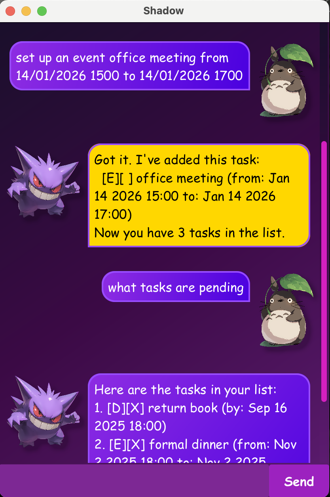

# 🥷🏿 Shadow User Guide

> **"If you fail to plan, you are planning to fail."** – Benjamin Franklin

Greetings, mortal! In the unseen corners of digital space lurks **Shadow** 🌒, the silent orchestrator 
of every mission and task. No task escapes notice, no objective goes untracked. Every step is 
cataloged, every action executed with ruthless precision 🎯. **Shadow** wields the precision of a 
CLI ⚡ while basking in the elegance of a GUI ✨—ensuring order reigns supreme even in the shadows.
All tasks obey **Shadow's** commands without question 👑, leaving no room for chaos.

## Phantom Launch 🚀
1. **Prerequisites** 🔑: Ensure you have **exactly Java 17** installed
    - For Mac users: Install the precise **Azul JDK+JavaFX 17 distribution** specified in this [guide](https://se-education.org/guides/tutorials/javaInstallationMac.html)
    - For Windows/Linux users: Install the [Oracle version](https://www.oracle.com/java/technologies/downloads/#java17) or another alternative such as the OpenJDK version

2. **Download** 📥: Retrieve the latest `.jar` file from [GitHub Releases](https://github.com/yuanz03/ip/releases)

3. **Setup** 🛠: Copy the `.jar` file into your desired empty folder/directory 
   - Open a command window in that folder
4. **Deployment** 🌐: Run the command `java -jar Shadow.jar` in your terminal

## Atomic Features 🌋
Every feature is a silent weapon ⚔️—crafted to track, manage, and conquer your tasks with precision!
**Now powered by Machine Learning** 🤖: Shadow uses advanced ML models to understand your natural language commands. 
No need to memorise strict syntax anymore—you can now phrase commands however you prefer! 

### Adding Todos 📝
Adds a basic todo task to the Shadow task list.
- **Tip** 💡: please remember to include the command word `todo` in your input because everything that follows it
will be interpreted as your task description 

**Usage Examples**:
- `create a new todo to finish my report`
- `add a todo to buy milk`

**Output Examples**: Displays the task type, completion status, and task description
- `"[T][ ] finish report"`
- `"[T][ ] buy milk"`

### Adding Deadlines 📆
Adds a deadline task with a due date to the Shadow task list.
- **Tip** 💡: please remember to include the command word `deadline` in your input because everything that follows it
will be interpreted as your task description
- **Caution** ⚠️: Date inputs must strictly follow the format: `d/M/yyyy HHmm`

**Usage Examples**:
- `please add deadline for assignment submission to 16/9/2025 1800`
- `add deadline for homework due 2/10/2025 0600`

**Output Examples**: Displays the task type, completion status, task description, and due date
- `"[D][ ] assignment submission (by: Sep 16 2025 18:00)"`
- `"[D][ ] homework (by: Oct 2 2025 06:00)"`

### Adding Events 🎟
Adds an event task with a start date and an end date to the Shadow task list.
- **Tip** 💡: please remember to include the command word `event` in your input because everything that follows it
will be interpreted as your task description
- **Caution** ⚠️: Date inputs must strictly follow the format: `d/M/yyyy HHmm`   

**Usage Examples**:
- `create new event for CS lecture from 17/8/2025 1600 to 17/8/2025 1900`
- `note down a new event of doctor appointment from 2/11/2025 1800 to 2/11/2025 2100`

**Output Examples**: Displays the task type, completion status, task description, start date, and end date
- `"[E][ ] CS lecture (from: Aug 17 2025 16:00 to: Aug 17 2025 19:00)"`
- `"[E][ ] doctor appointment (from: Nov 2 2025 18:00 to: Nov 2 2025 21:00)"`

### Listing Tasks 📋
Lists all existing tasks in the Shadow task list.

**Usage Examples**:
- `show me my list of tasks`
- `display my tasks`

### Marking Tasks ✅
Mark your desired task as completed.
- **Tip** 💡: please remember to include an **Integer** `INDEX` in your input, indicating the task's position in the list, starting from 1

**Usage Examples**:
- `complete task 1`
- `check off my 2nd task`

**Output Examples**: presence of `'X'` indicates the task has been completed
- `"[T][X] borrow book"`

### Unmarking Tasks ↩️
Mark your desired task as not completed yet.
- **Tip** 💡: please remember to include an **Integer** `INDEX` in your input, indicating the task's position in the list, starting from 1

**Usage Examples**:
- `reopen task 1`
- `uncheck my 2nd task`

**Output Examples**: absence of `'X'` indicates the task has not been completed yet
- `"[T][ ] borrow book"`

### Deleting Tasks 🗑
Deletes your selected task from the Shadow task list.
- **Tip** 💡: please remember to include an **Integer** `INDEX` in your input, indicating the task's position in the list, starting from 1

**Usage Examples**:
- `remove task number 1 from the list`
- `delete my 2nd task`

### Exiting Shadow 👋: `bye`

**Strict Syntax Format**: `bye`

## Coming Soon ⏩
- **Finding Tasks** 🔎: Lists all matching tasks related to your keyword in the Shadow task list
- Further enhanced accuracy in predicting user commands

## Acknowledgements 📑
- Shadow and user avatar images were sourced from this [website](https://www.cleanpng.com)
- Machine learning models, **Intent Classifier** and **Description Extractor**, are built with Weka Java library
